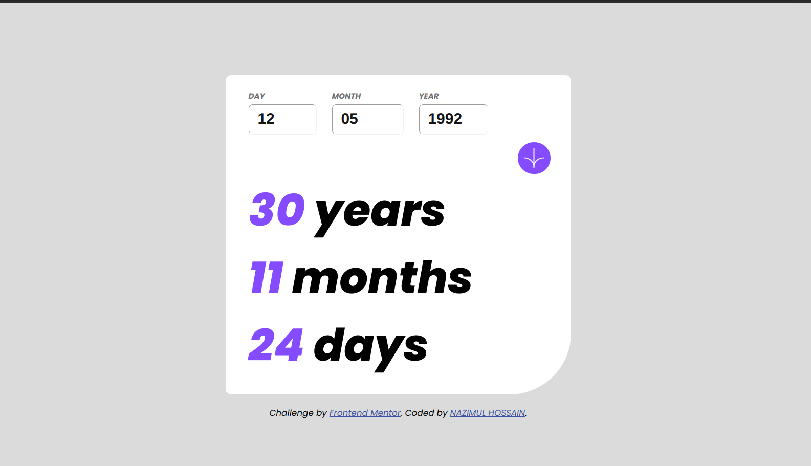
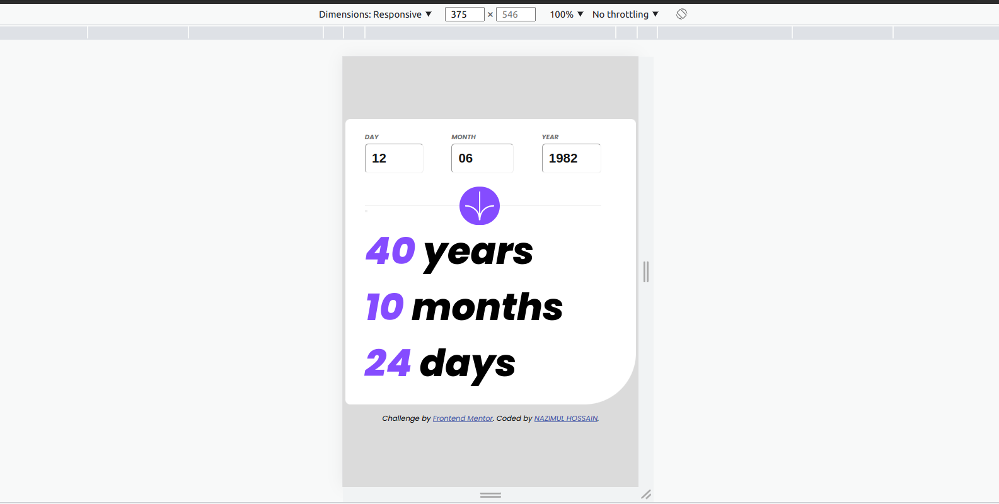
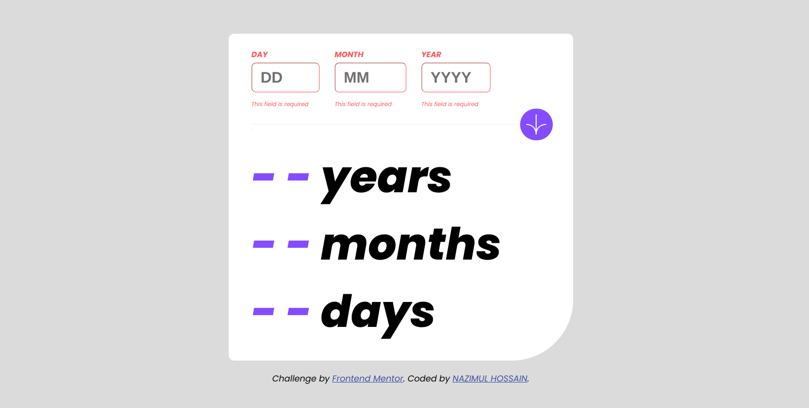
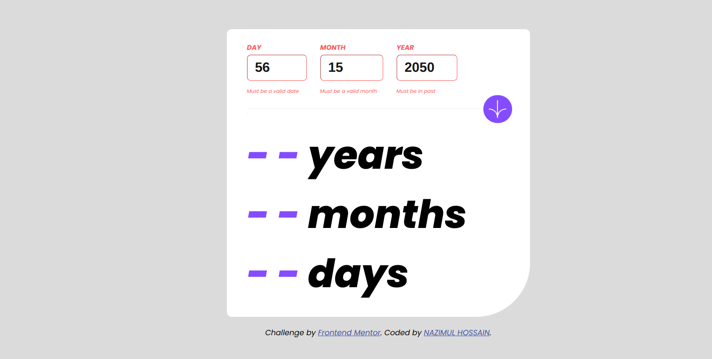

# Frontend Mentor - Age calculator app solution

This is a solution to the [Age calculator app challenge on Frontend Mentor](https://www.frontendmentor.io/challenges/age-calculator-app-dF9DFFpj-Q). Frontend Mentor challenges help you improve your coding skills by building realistic projects.

## Table of contents

- [Overview](#overview)
  - [The challenge](#the-challenge)
  - [Screenshot](#screenshot)
  - [Links](#links)
- [My process](#my-process)
  - [Built with](#built-with)
  - [What I learned](#what-i-learned)

## Overview

### The challenge

Users should be able to:

- View an age in years, months, and days after submitting a valid date through the form
- Receive validation errors if:
  - Any field is empty when the form is submitted
  - The day number is not between 1-31
  - The month number is not between 1-12
  - The year is in the future
  - The date is invalid e.g. 31/04/1991 (there are 30 days in April)
- View the optimal layout for the interface depending on their device's screen size
- See hover and focus states for all interactive elements on the page
- **Bonus**: See the age numbers animate to their final number when the form is submitted

### Screenshot

- Desktop View:



- Mobile View :



- No Input Error View :



- Invalid Entry :



### Links

- Solution URL: (https://github.com/nazimulhossain/age-calculator)
- Live Site URL: (https://chic-alpaca-cede2c.netlify.app/)

## My process

### Built with

- Semantic HTML5 markup
- CSS custom properties
- Flexbox
- CSS Media Queries
- CSS Animation
- Javascript
- Events
- Date Object

### What I learned

how to use css animation and learned about oninput event use in input to restrict input type number to its maxlength(which not works in input type number).

To see how you can add code snippets, see below:

```css
@keyframes shake {
  0%,
  100% {
    transform: translateX(0);
  }
  10%,
  30%,
  50%,
  70%,
  90% {
    transform: translateX(-10px);
  }
  20%,
  40%,
  60%,
  80% {
    transform: translateX(10px);
  }
}

.result {
  display: inline-block;
  animation: shake 2s ease;
}
```

```html
<input
  placeholder="YYYY"
  class="year"
  id="year"
  type="number"
  oninput="javascript: if (this.value.length > this.maxLength) this.value = this.value.slice(0, this.maxLength);"
  maxlength="4"
  required
/>
```

## Author

- Frontend Mentor - [@nazimulhossain](https://www.frontendmentor.io/profile/nazimulhossain)
